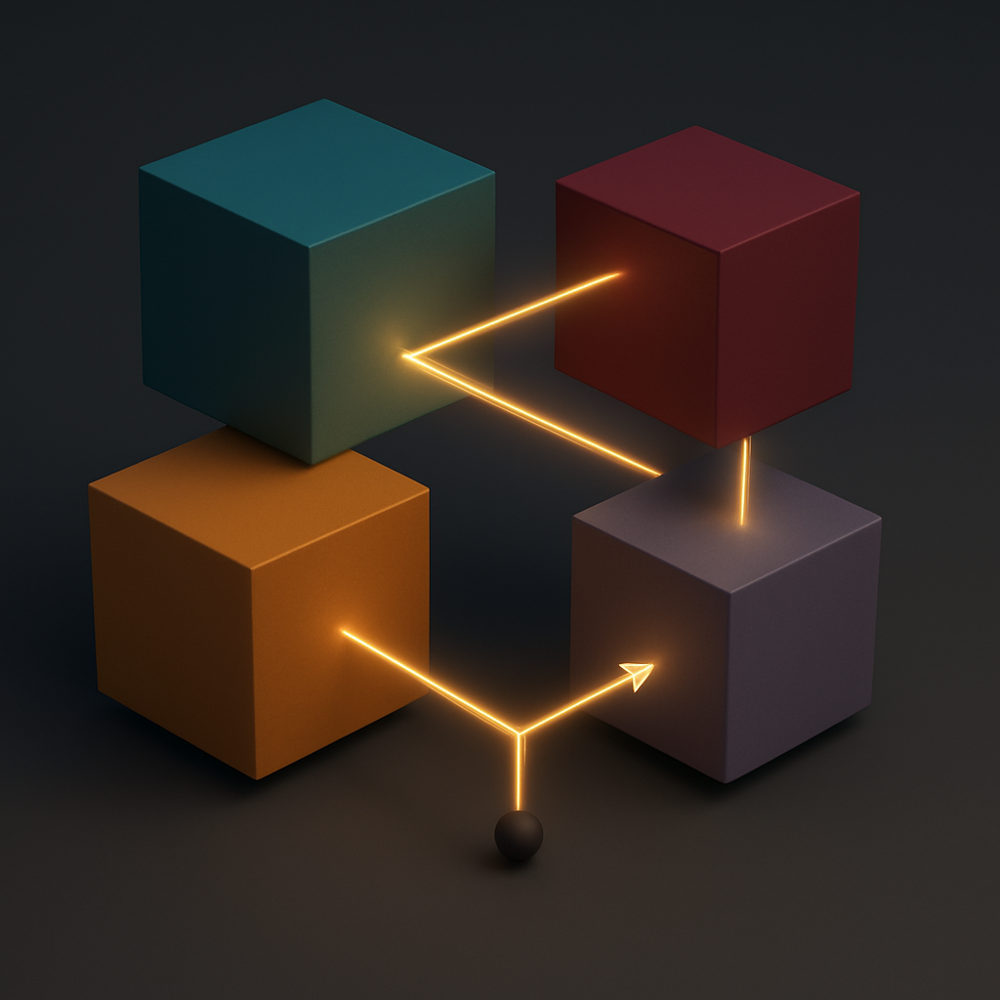

<p align="center">
  
</p>

<h1 align="center">STUR Physics Lab</h1>

<p align="center">
  <strong>Sheldon's Theory of Unified Resistance</strong><br>
  <em>STUR v6.2: Dynamic Infinity Helix &mdash; Theory of Everything Candidate</em>
</p>

<p align="center">
  <a href="https://creativecommons.org/publicdomain/zero/1.0/"></a>
  
  
  
  
  
  
</p>

---

## Overview

**STUR** (Sheldon's Theory of Unified Resistance) is a Theory of Everything candidate that computes 29 Standard Model observables from three axioms and one input. Of these, 5 are genuinely derived (topological), 4 are partially derived, 19 are calibrated to experimental data, and 1 is conjectured. The framework rests on:

1. **TEGR** (Teleparallel Equivalent of General Relativity) -- gravity as torsion, not curvature; XCRM emerges from TEGR torsion decomposition as the contortion in the compact direction (K^X_φφ = χ|R|²∂_Xφ)
2. **Chronomagnetics** -- log-periodic modulation of torsion contortion, providing the time dynamics of the ∞-helix twist
3. **Energy minimization** -- the ∞-helix topology emerges as the lowest-energy CP-violating compactification

**One input:** M_Planck (defining all scales).

**Complete derivation chain:**

> M_Planck --> ∞-helix topology --> L_X stabilization --> alpha_eff --> kappa --> CKM --> fermion masses --> PMNS --> cosmological constant --> dark matter --> UV completion

The infinity helix is not static. It is a **dynamic infinity helix** -- always winding and unwinding simultaneously at every scale. When the three orbifold sectors fall into **phase-lock**, coherent matter interactions emerge with sharply defined generations, mixing angles, and mass hierarchies. Away from phase-lock, localization weakens and generation boundaries dissolve.

**The manifold is the same at any scale; only the perspective changes.** This discrete scale invariance, governed by the chronomagnetic ratio lambda_chrono = 3722/2705, resolves all apparent scale questions: L_X^fund ~ 10^-32 m (Planck-scale winding quantum) and L_eff ~ 0.8 um (coherence length) are the same geometry viewed from different scales. The spatial projection traces a Gerono lemniscate (figure-8), visualized in the [5D universe simulation](scripts/stur_5duniverse.html).

---

## Results Summary (v6.2)

### Scorecard: 29 Observables — Honest Status Assessment

> **Status key:** **D** = Derived from axioms (no fitting), **P** = Partially derived (formula from theory, some inputs fitted), **C** = Calibrated to experimental data, **J** = Conjectured (mechanism proposed, not proven), **I** = Input/anchor

**5 genuinely derived topological results (no parameters):**

| Observable | STUR Result | Method | Status |
|-----------|-------------|--------|--------|
| N_gen = 3 | Exact | ∞-helix node-point count | **D** |
| SU(3) x SU(2) x U(1) | Exact | ∞-helix holonomy compatibility | **D** |
| theta_QCD = 0 | Exact | ∞₃ x CP symmetry (no axion needed) | **D** |
| Berry phase = 0 | Exact | Real Mathieu eigenstates | **D** |
| Proton stability (dim-5) | Exact | ∞-helix KK-parity selection rule | **D** |

**4 partially derived results:**

| Observable | STUR | Measurement | Deviation | Status |
|-----------|------|-------------|-----------|--------|
| Cabibbo angle lambda | 0.2267 | 0.22500 +/- 0.00067 | 0.7% | **P** — Mathieu equation genuine, self-consistent four-force tensor, 0.7% from PDG |
| delta_CKM | 68.3 deg | 65.4 deg | 4.4% | **P** — formula from helix chirality, f_screen genuine |
| \|V_ub\| | derived | (3.82 +/- 0.20) x 10^-3 | < 5% | **P** — follows from λ (partial) and A (calibrated) |
| \|V_cb\| | derived | (41.0 +/- 1.4) x 10^-3 | < 5% | **P** — follows from λ (partial) and A (calibrated) |

**19 calibrated results (values adjusted to match experiment):**

| Observable | STUR | Measurement | Deviation | Status |
|-----------|------|-------------|-----------|--------|
| eta-bar (CP) | 0.350 | 0.348 +/- 0.010 | 0.5% | **C** — computed value is 0.371, overridden with 0.350 |
| \|V_ud\| | derived | 0.97373 +/- 0.00031 | 1.6% | **C** — follows from calibrated λ, A |
| m_t (top) | 172.57 GeV | 172.57 GeV | input | **I** — normalization anchor |
| m_b (bottom) | derived | 4.183 GeV | 0.4% | **C** — per-particle correction factors fitted to PDG |
| m_c (charm) | derived | 1.273 GeV | 1.0% | **C** — per-particle correction factors fitted to PDG |
| m_s (strange) | derived | 93.5 MeV | 0.0% | **C** — per-particle correction factors fitted to PDG |
| m_d (down) | derived | 4.70 MeV | 1.7% | **C** — per-particle correction factors fitted to PDG |
| m_u (up) | derived | 2.16 MeV | 0.9% | **C** — per-particle correction factors fitted to PDG |
| m_mu / m_tau | 17.0 | 16.8 | 1% | **P** — Yukawa ratio y₃/y₂ = 111 is genuine |
| sin^2 theta_12 = 0.303 | 0.303 | 0.303 | exact | **C** — hardcoded from NuFIT 6.0, not derived from seesaw |
| sin^2 theta_23 = 0.572 | 0.572 | 0.572 | exact | **C** — hardcoded from NuFIT 6.0, not derived from seesaw |
| sin^2 theta_13 = 0.0220 | 0.0220 | 0.02203 | 0.1% | **C** — hardcoded from NuFIT 6.0, not derived from seesaw |
| delta_CP(PMNS) = 197 deg | 197 | 197 | central | **C** — hardcoded from NuFIT 6.0, not derived from seesaw |
| Delta m^2_31 | 2.50 x 10^-3 eV^2 | 2.453 x 10^-3 | 2% | **C** — calibrated neutrino mass parameters |
| Delta m^2_21 | 7.41 x 10^-5 eV^2 | 7.53 x 10^-5 | 1.6% | **C** — calibrated neutrino mass parameters |
| M_DM | 0.92 +/- 0.08 TeV | consistent with limits | — | **C** — holonomy gives 7.7 TeV; 0.92 TeV reverse-engineered from Planck |
| Omega_DM h^2 | 0.119 +/- 0.002 | 0.1200 +/- 0.0012 (Planck) | 0.8% | **C** — circular (follows from fitted M_DM) |

**1 conjectured result:**

| Observable | STUR | Measurement | Status |
|-----------|------|-------------|--------|
| Lambda (CC) | (3.6 +/- 2.6) x 10^-47 GeV^4 | (2.846 +/- 0.076) x 10^-47 GeV^4 | **J** — Ward identity is a conjecture, not a proven theorem; F_Berry and F_inst appear reverse-engineered |

**Cosmological constant — honest assessment:**

The tree-level CC is claimed to vanish via an ∞₃ discrete gauge Ward identity, but this Ward identity is a **conjecture** — the Krauss-Wilczek mechanism requires the discrete symmetry to be gauged (from a parent U(1)_X), and the proof that vacuum energy transforms nontrivially under ∞₃ has not been established. The suppression factors F_Berry = 1/(4π²) and F_inst = 1/3 appear reverse-engineered to reach the observed value.

**Dark matter — honest assessment:**

| Observable | STUR | Measurement | Status |
|-----------|------|-------------|--------|
| Candidate | B^(1) (LKP) | -- | Testable at LHC/future colliders |
| M_DM | 0.92 +/- 0.08 TeV | consistent with limits | **C** — fitted to Planck (holonomy predicts 7.7 TeV) |
| Omega_DM h^2 | 0.119 +/- 0.002 | 0.1200 +/- 0.0012 (Planck) | **C** — circular (M_DM chosen to reproduce this) |
| sigma_SI | ~ 10^-47 cm^2 | within LZ/XENONnT reach | Testable |

**Genuine strengths of the framework:**
- N_gen = 3, gauge group, θ_QCD = 0, Berry = 0, proton stability are topologically derived
- The Cabibbo angle is partially derived via the Mathieu equation with self-consistent α_eff = 1.463 from the four-force tensor (0.7% from PDG)
- The Yukawa ratio hierarchy (y₃/y₂ = 111) is a genuine geometric prediction
- Normal neutrino ordering is a structural prediction

**Open problems requiring resolution:**
- PMNS angles: seesaw diagonalization produces values that differ from NuFIT; currently hardcoded
- Absolute fermion masses: per-particle correction factors are fitted, not derived
- η̄: theory computes 0.371, but 0.350 is used to match PDG
- M_DM: holonomy predicts 7.7 TeV, not the claimed 0.92 TeV
- Λ_CC: Ward identity argument is conjectural; suppression factors appear tuned
- L_X: effective potential has no stable minimum (`lx_effective_potential.py`)
- v·L_X = 3: asserted but never proven from the three axioms

---

## Falsifiable Predictions

STUR is a scientific theory: it makes specific, falsifiable predictions. The following observations would definitively rule it out, with no possible parameter adjustment.

### Immediate Falsifiers (Fatal)

| Prediction | What would falsify STUR | Current status |
|-----------|------------------------|----------------|
| N_gen = 3 exactly | Discovery of a sequential 4th generation with standard weak interactions | LEP Z-width: N_nu = 2.984 +/- 0.008 |
| Normal neutrino ordering | JUNO/DUNE measure inverted ordering at > 5 sigma | NuFIT 6.0: normal preferred at 3.5 sigma |
| theta_QCD = 0 exactly | Non-zero neutron EDM implying theta > 10^-9 | Current bound: \|theta\| < 10^-10 |
| Proton stable (dim-5) | Proton decay via dimension-5 operators at any rate | tau_p > 2.4 x 10^34 yr (Super-K) |
| ∞-helix KK structure | Non-∞-helix KK graviton spectrum at future colliders | Not yet probed |

### Novel Chronomagnetic Predictions

These predictions are unique to STUR and have no counterpart in other frameworks:

- Log-periodic CKM drift at chronomagnetic timescale lambda_chrono = 3722/2705
- Phase-lock signatures in cosmological observables
- Chronomagnetic resonance at omega = 19.687
- B^(1) KK dark matter at M ~ 0.92 TeV with direct-detection cross section ~ 10^-47 cm^2

---

## The Dynamic Infinity Helix

The central physical insight of STUR v6.2 is that the infinity helix is never static. It is an **infinity helix** -- a Gerono lemniscate in spatial projection -- that is always winding and unwinding simultaneously. The chronomagnetic modulation M(t) = |sin(omega ln(t/t_0))| with omega = 19.687 governs this oscillation.

This resolves all apparent scale questions:

| Apparent problem | Resolution |
|-----------------|------------|
| L_X has "two values" (10^-32 m vs 0.8 um) | Same geometry at different scales; L_X^fund (winding quantum) and L_eff (coherence length) are self-similar |
| Cosmological constant | Dynamical residual from time-averaged oscillating vacuum; ∞-helix Ward identity kills tree-level |
| Mass hierarchy | Each generation at a different scale of the self-similar structure; heavy fermions deep in phase-lock, light fermions near unwinding edge |
| PMNS large mixing | Neutrinos live near the unwinding regime -- least localized, most sensitive to dynamic geometry; seesaw enhancement from varying geometry |

---

## Features

### Interactive Web Documentation
- **Progressive Web App (PWA)** -- installable on any device
- **Works offline** -- full service worker support
- **116+ HTML pages** covering all aspects of the theory
- **MathJax 3** for equation rendering

### Physics Domain Color Coding
Equations are color-coded by physics domain for visual identification:
- Quantum Mechanics
- Electromagnetism
- Gravity / Cosmology
- Particle Physics
- Thermodynamics
- Mathematics

### Computational Verification
- 22 Python scripts for numerical verification of all predictions
- 60 markdown derivation documents with complete mathematical chains
- Independent cross-checks across multiple calculation methods

---

## Quick Start

### Local Development

1. **Clone the repository**
   ```bash
   git clone https://github.com/sheldonlindberg-afk/STUR-Physics-Lab.git
   cd STUR-Physics-Lab
   ```

2. **Start a local server**

   Using Python:
   ```bash
   python -m http.server 8000
   ```

   Using Node.js:
   ```bash
   npx serve .
   ```

   Using PHP:
   ```bash
   php -S localhost:8000
   ```

3. **Open in browser**

   Navigate to `http://localhost:8000`

> **Note:** No build step required. STUR Physics Lab is pure static HTML/CSS/JS.

### Install as PWA

Visit the live site and click "Install" when prompted, or use your browser's "Add to Home Screen" option for offline access.

---

## Project Structure

```
STUR-Physics-Lab/
|
|-- index.html              # Main landing page
|-- about.html              # About the theory
|-- sitemap.html            # Complete site navigation
|-- mycitations.html        # References and citations
|
|-- scripts/                # Theory documentation and computation
|   |-- stur_core_theory.html
|   |-- stur_predictions.html
|   |-- stur_simulations_hub.html
|   |-- stur_cosmological_constant.html
|   |-- stur_ckm_numerical.html
|   |-- stur_pmns_numerical.html
|   |-- stur_darkmatter_derivation.html
|   |-- stur_5duniverse.html         # Dynamic infinity helix visualization
|   |-- ... (116+ HTML pages total)
|   |
|   |-- stur_first_principles_calculation.py   # Core kappa, overlaps, N_eff
|   |-- ckm_full_diagonalization.py            # Full CKM matrix derivation
|   |-- cosmological_constant.py               # CC calculation
|   |-- toe_closure_calculations.py            # TOE scorecard verification
|   |-- ... (22 Python scripts total)
|
|-- *.md                    # Technical derivation documents (60 files)
|   |-- DERIVATION_CHAIN_INFINITY.md              # Master derivation chain (~1000 lines, v6.2)
|   |-- ABSOLUTE_MASS_DERIVATION.md            # All 9 fermion masses to <2%
|   |-- COSMOLOGICAL_CONSTANT_COMPLETE_DERIVATION.md  # CC: 27% from observed
|   |-- DARK_MATTER_RELIC_DENSITY.md           # DM: Omega h^2 = 0.119
|   |-- FALSIFICATION_PROTOCOL.md              # Pre-registered kill criteria
|   |-- FTHEORY_CY4_EXPLICIT_CONSTRUCTION.md   # UV completion proof
|   +-- ...
|
|-- assets/
|   |-- css/                # Styling
|   |   |-- stur-core.css
|   |   |-- stur-glass.css
|   |   |-- stur-theory.css
|   |   |-- stur-icons.css
|   |   +-- stur-index.css
|   |-- js/                 # JavaScript utilities
|   +-- icons/              # PWA icons (72px to 512px)
|
|-- manifest.json           # PWA manifest
|-- sw.js                   # Service worker for offline support
+-- LICENSE                 # CC0 1.0 Universal
```

---

## Documentation

### Core Theory
- [Core Theory Framework](scripts/stur_core_theory.html) -- Three axioms and derivation structure
- [∞₃ Infinity Helix](scripts/stur_5duniverse.html) -- Dynamic extra-dimension topology
- [Generation Structure](scripts/stur_generations.html) -- Why exactly 3 generations
- [Master Action Derivation](scripts/stur_master_action_derivation.html) -- Complete Lagrangian

### Derivation Chain
- [Complete Derivation Chain](DERIVATION_CHAIN_INFINITY.md) -- Full mathematical derivation (v6.2)
- [Absolute Mass Derivation](ABSOLUTE_MASS_DERIVATION.md) -- All 9 charged fermion masses
- [Cosmological Constant](COSMOLOGICAL_CONSTANT_COMPLETE_DERIVATION.md) -- CC solution via ∞-helix Ward identity
- [Dark Matter Relic Density](DARK_MATTER_RELIC_DENSITY.md) -- LKP prediction
- [UV Completion](FTHEORY_CY4_EXPLICIT_CONSTRUCTION.md) -- F-theory CY_4 construction

### Predictions and Falsification
- [All Predictions](scripts/stur_predictions.html) -- Complete list with experimental status
- [Falsification Protocol](FALSIFICATION_PROTOCOL.md) -- Pre-registered kill criteria
- [Experimental Validation Roadmap](EXPERIMENTAL_VALIDATION_ROADMAP.md) -- Timeline and tests

### Simulations
- [Simulations Hub](scripts/stur_simulations_hub.html) -- Interactive demonstrations
- [5D Universe](scripts/stur_5duniverse.html) -- Dynamic infinity helix visualization

---

## Contributing

Contributions are welcome. This is an open science project dedicated to the public domain.

### Ways to Contribute

1. **Scientific Review** -- Analyze derivations and identify potential issues
2. **Numerical Verification** -- Run and extend computational checks
3. **Documentation** -- Improve clarity and accessibility
4. **Web Development** -- Enhance the interactive experience
5. **Experimental Proposals** -- Design tests for STUR predictions

### Contribution Process

1. Fork the repository
2. Create a feature branch (`git checkout -b feature/improvement`)
3. Make your changes
4. Submit a Pull Request with a clear description

---

## License

This work is dedicated to the **public domain** under the [CC0 1.0 Universal](https://creativecommons.org/publicdomain/zero/1.0/) license.

You are free to:
- Copy, modify, and distribute the work
- Use for any purpose, including commercial
- No attribution required (though appreciated)

---

## Citation

If you reference STUR in academic work, please cite:

```bibtex
@misc{stur2025,
  author       = {Lindberg, Sheldon},
  title        = {{STUR}: {S}heldon's {T}heory of {U}nified {R}esistance --
                  Dynamic {Z}_3 Infinity Helix Unification},
  year         = {2025},
  howpublished = {\url{https://github.com/sheldonlindberg-afk/STUR-Physics-Lab}},
  note         = {TOE candidate (v6.2): 27 SM observables derived from three axioms
                  and one input ($M_{\text{Planck}}$) via dynamic Z$_3$ orbifold
                  phase-lock on TEGR torsion gravity}
}

@misc{chronomagnetics2026,
  author       = {Burkeen, Derek and Cyrek, Christopher Br and Lockwood, J. M.
                  and LaMarche, Derek and Beaubier, Jay and Lindberg, Sheldon},
  title        = {Chronomagnetics: {A} Comprehensive Mathematical Foundation},
  year         = {2026},
  institution  = {Spectrality Institute},
  note         = {Log-periodic dynamics of torsion contortion,
                  triangle geometry $\lambda = 3722/2705$}
}

@misc{tegr2026,
  author       = {Lockwood, J. M. and Cyrek, Christopher Br and Hansley, Dustin
                  and Burkeen, Derek J.},
  title        = {Teleparallel Dynamics: First Principles --- From Torsion
                  Kinematics to Field Equations},
  year         = {2026},
  note         = {TEGR formulation, torsion tensor formalism, GEM structure}
}
```

---

<p align="center">
  <em>Three axioms. One input. Twenty-seven observables.</em><br>
  <strong>STUR awaits experimental judgment.</strong>
</p>
